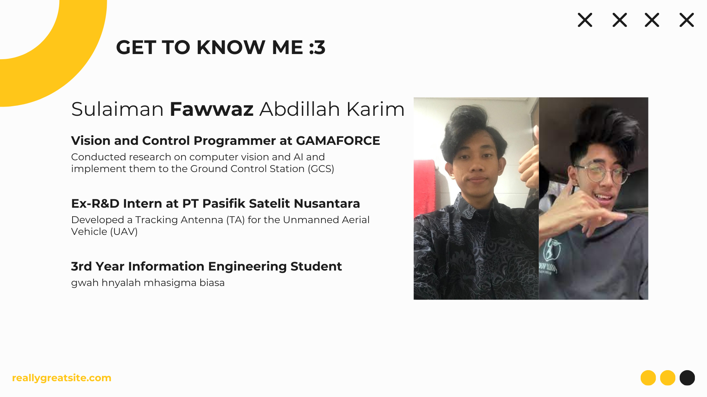
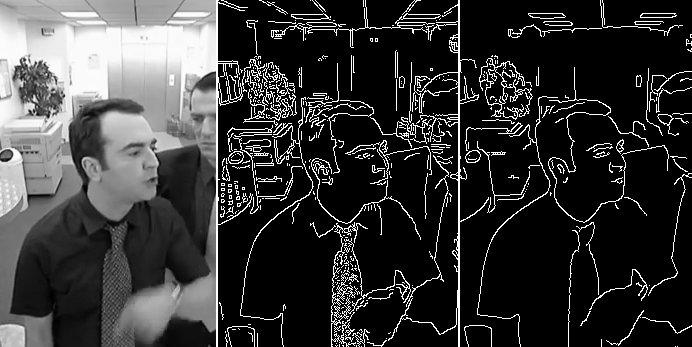

# 📸 Modul 1: Pendahuluan Image Processing

## Get To Know Me

## 0. Rencana Belajar
| **Pertemuan** | **Topik**                                  |
| ------------- | ------------------------------------------ |
| **1**         | **Setup & Intro to Image Processing**      |
| **2**         | **Basic Image Operations & Camera Access** |
| **3**         | **Thresholding & Bitwise Operation**       |
| **4**         | **Feature Detection & Transformation**     |
| **5**         | **AI in Image Processing + Project**       |
| **6**         | **Project & Class Wrap Up**                |

## 1. Apa itu Image Processing? 🖼️

Image Processing atau pemrosesan citra adalah teknik yang digunakan untuk memanipulasi dan menganalisis gambar dengan tujuan meningkatkan kualitasnya atau mengekstrak informasi tertentu. Proses ini dapat melibatkan berbagai operasi seperti filtering, edge detection, segmentasi, dan transformasi warna.

## 2. Mengapa Image Processing Penting? 🤔
Pemrosesan citra memiliki banyak manfaat di berbagai bidang, antara lain:
- **✨ Meningkatkan kualitas gambar**: Misalnya untuk memperjelas gambar hasil pemindaian medis atau citra satelit.
- **🔍 Ekstraksi informasi**: Seperti mendeteksi objek dalam gambar, membaca teks dari gambar (OCR), atau analisis pola.
- **🤖 Otomasi dan pengambilan keputusan**: Image Processing digunakan dalam AI dan machine learning untuk analisis visual otomatis.

## 3. Aplikasi Image Processing 🌍
Berikut adalah beberapa contoh aplikasi Image Processing yang relevan untuk berbagai jurusan:

### a. Teknologi Informasi 💻
- **🤖 Computer Vision**: Pengenalan wajah, deteksi objek, analisis citra berbasis AI.
- **🎮 Augmented Reality (AR) & Virtual Reality (VR)**: Pemrosesan gambar untuk lingkungan virtual yang lebih realistis.
- **📄 Optical Character Recognition (OCR)**: Penggunaan Image Processing untuk membaca teks dari dokumen atau papan reklame.

### b. Teknik Elektro ⚡
- **📟 Image Processing dalam Embedded Systems**: Implementasi algoritma pemrosesan citra pada perangkat tertanam (Raspberry Pi, FPGA, DSP, dll.).
- **🤖 Pemrosesan Citra dalam Robotika**: Navigasi robot berbasis visi komputer.
- **📡 Pengolahan Citra di Sinyal Telekomunikasi**: Kompresi gambar, peningkatan kualitas sinyal gambar dalam komunikasi.

### c. Teknik Biomedis 🏥
- **🧠 Pencitraan Medis (Medical Imaging)**: Pemrosesan gambar dari CT Scan, MRI, dan USG untuk diagnosis yang lebih akurat.
- **🔬 Segmentasi dan Klasifikasi Sel**: Digunakan dalam patologi digital untuk analisis jaringan dan deteksi kanker.
- **🦠 Pengolahan Citra untuk Mikroskopi**: Analisis gambar mikroskop untuk penelitian biologis dan medis.

## 4. Komponen Dasar dalam Image Processing 🏗️
Image Processing terdiri dari beberapa langkah dasar:
1. **📸 Akuisisi Gambar**: Pengambilan gambar dari kamera, sensor, atau perangkat lainnya.
2. **🎚️ Preprocessing**: Penyesuaian kontras, noise removal, dan filtering.
3. **🖍️ Segmentasi**: Pemisahan objek dari background.
4. **📊 Ekstraksi Fitur**: Mengambil karakteristik penting dari gambar.
5. **🧠 Klasifikasi dan Analisis**: Menggunakan algoritma machine learning atau deep learning untuk mengenali pola dalam gambar.

## 5. Perangkat dan Perangkat Lunak yang Digunakan 🛠️
Beberapa perangkat dan perangkat lunak yang sering digunakan dalam Image Processing antara lain:
- **💾 Software**: OpenCV, MATLAB, Python (PIL, scikit-image, TensorFlow/Keras untuk AI), ImageJ (untuk biomedis).
- **🔌 Hardware**: Raspberry Pi, Jetson Nano, FPGA, kamera thermal, mikroskop digital.

## 6. Tantangan dalam Image Processing ⚠️
Meskipun Image Processing sangat berguna, ada beberapa tantangan yang sering dihadapi, seperti:
- **📉 Kualitas Gambar yang Buruk**: Gambar yang buram, memiliki noise tinggi, atau resolusi rendah dapat mengurangi akurasi pemrosesan.
- **⏳ Kecepatan Pemrosesan**: Beberapa algoritma membutuhkan komputasi tinggi, terutama dalam aplikasi real-time.
- **🎭 Kesulitan dalam Segmentasi**: Memisahkan objek dari latar belakang bisa sulit dalam kondisi pencahayaan yang kompleks.

## 7. Kesimpulan 🎯
Image Processing adalah bidang yang sangat luas dan memiliki banyak aplikasi di berbagai industri, termasuk teknologi informasi, teknik elektro, dan teknik biomedis. Dengan memahami dasar-dasar pemrosesan citra, mahasiswa dapat mengembangkan berbagai solusi inovatif yang memanfaatkan analisis visual untuk berbagai kebutuhan praktis.

---
